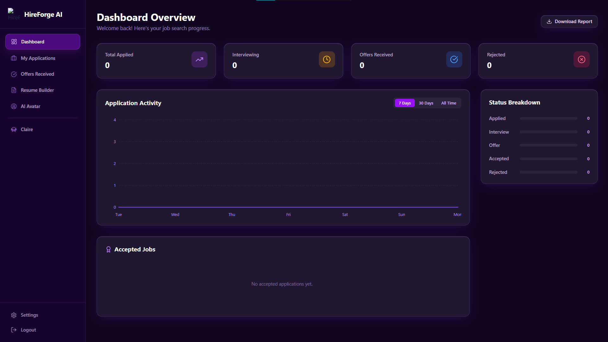

# 🤖 HireForgeAI

<p align="center">
  <strong>An AI-powered recruitment platform for intelligent CV screening and candidate ranking.</strong>
</p>

<p align="center">
  <a href="https://syedtwasti.github.io/HireForgeAI/">
    
  </a>
  
  
  
  
</p>

---

## 🌐 Live Demo

🔗 **https://syedtwasti.github.io/HireForgeAI/**

---

## 📸 Application Preview

<p align="center">
  
</p>

---

# 📖 Overview

**HireForgeAI** is an AI-powered recruitment platform designed to simplify the early stages of hiring by automating resume screening and candidate evaluation.

The platform helps recruiters quickly identify the most suitable applicants by comparing resumes against job requirements, reducing manual effort while improving hiring consistency.

Although the current release is a frontend prototype, the architecture is designed for seamless integration with AI and Natural Language Processing (NLP) models.

---

# ✨ Key Features

### 📄 Intelligent Resume Screening

- Upload and review candidate resumes
- Compare resumes against job requirements
- Extract relevant applicant information
- Reduce manual CV screening time

---

### 📊 Candidate Ranking

Automatically evaluate applicants using standardized scoring criteria.

Generate:

- Candidate Scores
- Skill Match Ratings
- Applicant Rankings

---

### ⚡ Fast Processing

- Screen multiple candidates efficiently
- Improve recruitment workflow
- Accelerate shortlist generation

---

### 🎯 Standardized Evaluation

Provides a consistent evaluation framework that helps minimize subjective decision-making during the initial screening process.

---

### 🧠 AI-Ready Architecture

Designed for future integration with:

- Resume Parsing
- Natural Language Processing (NLP)
- Semantic Job Matching
- Large Language Models (LLMs)
- Automated Candidate Recommendations

---

# ⚙️ System Workflow

```
            Candidate Resume
                    │
                    ▼
           Resume Upload Interface
                    │
                    ▼
          Resume Processing Engine
                    │
          (AI / NLP - Future)
                    │
                    ▼
        Candidate Skill Extraction
                    │
                    ▼
       Job Description Comparison
                    │
                    ▼
         Candidate Ranking Score
                    │
                    ▼
          Recruiter Dashboard
```

---

# 🔍 How HireForgeAI Works

## 1. Resume Submission

Candidates upload their resumes through the application interface.

---

## 2. Resume Processing

The system prepares candidate information for evaluation.

Future AI integration will include:

- Resume parsing
- Skill extraction
- Experience detection
- Education analysis
- Keyword identification

---

## 3. Candidate Evaluation

Each resume is compared against predefined hiring criteria and job requirements.

The platform generates:

- Match Percentage
- Candidate Score
- Overall Ranking

---

## 4. Recruiter Review

Recruiters receive an organized shortlist of applicants based on their compatibility with the selected role.

---

# 🛠 Technology Stack

| Category | Technologies |
|-----------|--------------|
| Frontend | HTML5, CSS3, JavaScript |
| Deployment | GitHub Pages |
| Planned AI Layer | Python, NLP, Machine Learning |
| Future Backend | FastAPI / Node.js |
| Future Database | PostgreSQL / MongoDB |

---

# 🚀 Getting Started

## Prerequisites

- Modern Web Browser
- Git (optional)

---

## Installation

Clone the repository:

```bash
git clone https://github.com/SyedTWasti/HireForgeAI.git

cd HireForgeAI
```

---

## Run Locally

Simply open:

```text
index.html
```

in your preferred web browser.

No installation or build process is required.

---

# 📁 Project Structure

```text
HireForgeAI/
│
├── assets/
├── index.html
├── style.css
├── script.js
└── README.md
```

---

# 🚧 Development Roadmap

Planned features include:

- ✅ AI Resume Parsing
- ✅ Job Description Matching Engine
- ✅ Candidate Dashboard
- ✅ Resume Skill Extraction
- ✅ NLP-based Candidate Ranking
- ✅ Technical Interview Recommendation System
- ✅ Backend API Integration
- ✅ Recruiter Authentication
- ✅ Database Integration
- ✅ Cloud Deployment

---

# 💡 Future Vision

HireForgeAI aims to evolve into a comprehensive AI recruitment ecosystem capable of:

- Semantic resume understanding
- Automated candidate recommendations
- Interview scheduling
- Recruiter analytics
- Hiring pipeline management
- AI-generated interview questions
- Predictive hiring insights

---

# 🤝 Contributing

Contributions are welcome.

If you have ideas for new features, improvements, or bug fixes, feel free to:

- Fork the repository
- Create a new branch
- Submit a Pull Request

For major changes, please open an issue first to discuss your proposal.

---

# 👨‍💻 Author

**Syed Tuaha Wasti**

GIS Engineer • AI Developer • Full Stack Developer

GitHub:
https://github.com/SyedTWasti

---

# ⚠️ Project Status

This project is currently a **frontend prototype** demonstrating the user interface and workflow of an AI-powered recruitment platform.

The AI engine, backend services, and resume processing modules are planned for future releases.

---

# 📄 License

This project is proprietary and confidential.

All rights reserved © 2026.
